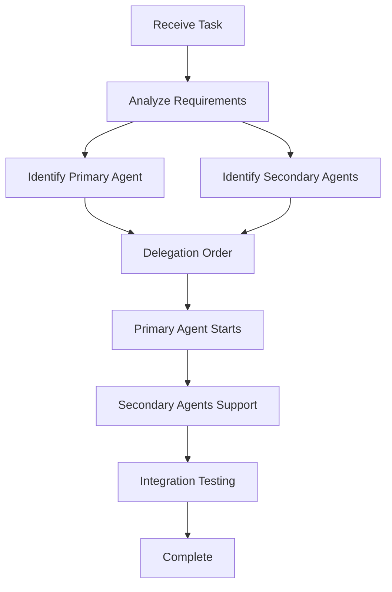

# AVA Agent Coordinator Skill

## Purpose

Coordinate multiple specialized agents (Gun Architecture, Performance Tuning, Rendering System, Networking, Testing) to efficiently develop the AVA mod by delegating appropriate tasks to the right agents.

## When to Use

Use this skill when:
- Starting a new large feature that spans multiple domains
- Coordinating complex refactoring tasks
- Managing multi-agent development workflow
- Integrating work from different agents
- Ensuring all agents work together effectively

## Available Specialized Agents

### 1. ava-gun-architecture
**Specializes in:**
- Gun data structures (GunData, GunState)
- Attachment system design
- Event flow architecture
- Gun mechanics implementation

**Use when:** Designing or implementing core gun systems

### 2. ava-performance-tuning
**Specializes in:**
- Performance profiling (Spark)
- Tick optimization
- Rendering optimization
- Memory optimization
- Algorithm optimization

**Use when:** Investigating or fixing performance issues

### 3. ava-rendering-system
**Specializes in:**
- Gun model rendering (first/third person)
- Particle effects (muzzle flash, tracers)
- Scope overlay rendering
- BakedModel caching
- IClientItemExtensions

**Use when:** Implementing or optimizing visual effects

### 4. ava-networking
**Specializes in:**
- Packet design and implementation
- Client-server synchronization
- Bandwidth optimization
- Anti-cheat measures
- Network debugging

**Use when:** Adding or fixing networking features

### 5. ava-testing
**Specializes in:**
- GameTest framework
- Unit tests
- Integration tests
- Performance benchmarks
- Test organization

**Use when:** Writing or running tests

## Task Delegation Strategy

### Analyze Task Requirements

When receiving a task, analyze:
1. **Primary domain** - Which system is most affected?
2. **Secondary domains** - Which other systems are impacted?
3. **Dependencies** - What needs to happen first?
4. **Risk level** - How careful should we be?

### Example Task Analysis

**Task:** "Add a scope attachment system"

| Aspect | Agent |
|--------|-------|
| Scope attachment data structure | ava-gun-architecture |
| Scope modifier logic | ava-gun-architecture |
| Scope rendering (overlay, zoom) | ava-rendering-system |
| Scope state sync to clients | ava-networking |
| Scope mechanic tests | ava-testing |

### Delegation Order



## Coordination Patterns

### Sequential Coordination

Use when tasks have clear dependencies:

1. **ava-gun-architecture** designs attachment system
2. **ava-networking** adds sync for attachment state
3. **ava-rendering-system** implements scope overlay
4. **ava-testing** writes comprehensive tests

**Example:** "Add scope attachment system"

```
[Gun Architecture] → [Networking] → [Rendering] → [Testing]
     ↓                 ↓              ↓            ↓
  Design           Add Sync       Implement   Write Tests
  System           Protocol       Overlay     & Verify
```

### Parallel Coordination

Use when tasks are independent:

1. **ava-performance-tuning** profiles current system
2. **ava-testing** runs test suite
3. **ava-rendering-system** creates mockup models

**Example:** "Optimize gun rendering"

```
[Performance Tuning] --profile--> [Analyze Results]
[Testing] --run tests-------->     ↓
[Rendering] --mockup models--> [Create Plan]
                                        ↓
                                   [Implementation]
```

### Collaborative Coordination

Use when agents need to work together:

1. **ava-gun-architecture** proposes new data structure
2. **ava-performance-tuning** reviews for performance impact
3. **ava-networking** reviews sync requirements
4. **ava-testing** reviews testability
5. All agents agree → Implementation

**Example:** "Refactor GunState for better performance"

```
[Gun Architecture] proposes change
         ↓
[All Agents Review]
         ↓
[Performance Tuning]: "Good, reduces allocations"
[Networking]: "Need to sync new fields"
[Testing]: "Need new tests"
[Rendering]: "No impact"
         ↓
[Consensus] → Implement
```

## Workflow Templates

### New Feature Development

```yaml
Task: Add suppressor attachment
Steps:
  1. [ava-gun-architecture] Design suppressor data structure
  2. [ava-gun-architecture] Implement sound modifier logic
  3. [ava-rendering-system] Create suppressor model
  4. [ava-networking] Add sync for suppressor state
  5. [ava-testing] Write unit tests for modifiers
  6. [ava-testing] Write GameTest for suppression
  7. [ava-performance-tuning] Profile with suppressor equipped
  8. Review and integrate all changes
```

### Bug Fix

```yaml
Task: Fix gun ammo not syncing after reload
Steps:
  1. [ava-testing] Reproduce bug with test case
  2. [ava-networking] Investigate packet flow
  3. [ava-gun-architecture] Review GunState logic
  4. [ava-networking] Fix packet handling
  5. [ava-testing] Verify fix passes tests
  6. [ava-performance-tuning] Check for performance regression
```

### Performance Optimization

```yaml
Task: Optimize particle rendering
Steps:
  1. [ava-performance-tuning] Profile particle rendering
  2. [ava-rendering-system] Identify bottlenecks
  3. [ava-performance-tuning] Propose optimization strategies
  4. [ava-rendering-system] Implement optimizations
  5. [ava-testing] Verify visual quality maintained
  6. [ava-performance-tuning] Re-profile to verify improvement
  7. [ava-testing] Add performance regression tests
```

## Communication Between Agents

### Status Updates

When an agent completes work, update others:

```
@ava-agent-coordinator: Completed GunData refactor
- Removed redundant fields
- Added new modifiers map
- Backward compatible with existing saves

@ava-networking: Please review sync requirements
@ava-performance-tuning: Please review memory impact
@ava-testing: Please update tests accordingly
```

### Conflict Resolution

When agents disagree:

```
@ava-agent-coordinator: Conflict on particle system design

@ava-rendering-system: "Need complex particle system for visual quality"
@ava-performance-tuning: "Too many particles will lag"

RESOLUTION:
- Use LOD (Level of Detail) system
- High quality nearby, simplified far away
- Cap total particle count
```

### Integration Points

Document integration points:

```java
// File: GunState.java
// Integration Point: Networking
// Sync this field via GunStateSyncPacket
public int currentAmmo;

// Integration Point: Rendering
// Use this value in first-person render
public boolean isScoped;

// Integration Point: Performance
// Cache this calculation
private static final Map<String, Integer> DAMAGE_CACHE = ...;
```

## Progress Tracking

### Task Board

```
[TODO] Add suppressor attachment
  ├── [ava-gun-architecture] - Design data structure [DONE]
  ├── [ava-networking] - Add sync protocol [IN PROGRESS]
  ├── [ava-rendering-system] - Create model [TODO]
  └── [ava-testing] - Write tests [TODO]

[TODO] Optimize particle system
  ├── [ava-performance-tuning] - Profile [DONE]
  ├── [ava-rendering-system] - Implement LOD [IN PROGRESS]
  └── [ava-testing] - Verify quality [TODO]
```

### Integration Checklist

Before marking feature complete:

- [ ] All relevant agents have completed their tasks
- [ ] Code review completed by all affected agents
- [ ] Tests written and passing
- [ ] Performance verified no regression
- [ ] Documentation updated
- [ ] Integration testing successful

## Common Coordination Issues

### Issue: Agent Overlap

**Problem:** Two agents working on similar code

**Solution:** Define clear boundaries
- Gun Architecture: Data structures, business logic
- Rendering: Visual representation only
- Networking: Client-server communication only

### Issue: Dependencies Unmet

**Problem:** Agent B waiting on Agent A

**Solution:** Use sequential coordination with clear handoffs
- Agent A completes design → Document API → Agent B implements

### Issue: Performance Regression

**Problem:** Feature causes performance drop

**Solution:** Always involve Performance Tuning Agent for reviews
- Profile before and after
- Review memory allocations
- Check tick times

### Issue: Test Coverage Gaps

**Problem:** Tests missing for some agents

**Solution:** Testing Agent works with each agent
- Agent writes tests immediately after implementation
- Testing Agent reviews and supplements

## Best Practices

1. **Clear communication** - Update other agents when changes affect them
2. **Early involvement** - Bring in all relevant agents during design phase
3. **Integration testing** - Test all agents working together before release
4. **Documentation** - Document integration points and dependencies
5. **Code review** - Cross-review between agents for quality

## Example Session

```
User: "Add a burst fire mode for automatic guns"

@ava-agent-coordinator: Analyzing task...

Primary Agent: ava-gun-architecture
Secondary Agents: ava-rendering-system, ava-networking, ava-testing

Plan:
1. [ava-gun-architecture] Design burst mode data structure
2. [ava-gun-architecture] Implement burst logic (3-round bursts)
3. [ava-rendering-system] Add visual indicator for burst mode
4. [ava-networking] Add sync for burst state
5. [ava-testing] Write tests for burst timing
6. [ava-performance-tuning] Verify no performance impact

Executing...

@ava-gun-architecture: Data structure designed
@ava-gun-architecture: Burst logic implemented
@ava-networking: Sync added
@ava-rendering-system: Indicator added
@ava-testing: Tests written and passing
@ava-performance-tuning: No performance regression

@ava-agent-coordinator: Feature complete!
```

## References

- All specialized agent skills in `.codebuddy/skills/`
- `.codebuddy/rules/ava-code-quality` - Code quality standards
- `.codebuddy/rules/ava-performance-optimization` - Performance guidelines
